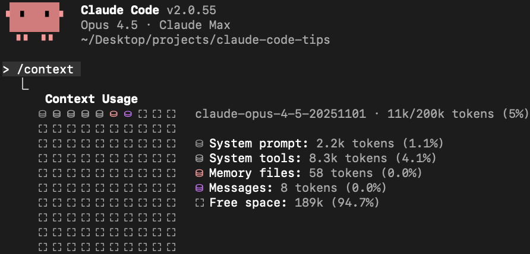
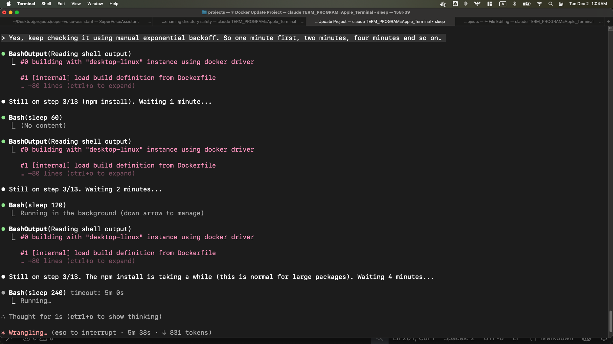

# 30 Claude Code Tips: From Basics to Advanced (Work in Progress - 21 tips so far)

Tips for getting the most out of Claude Code - includes a custom status line script, system prompt patching, and using Gemini CLI as Claude Code's minion.

## Tip 0: Customize your status line

You can customize the status line at the bottom of Claude Code to show useful info. I set mine up to show the model, current directory, git branch (if any), uncommitted file count, sync status with origin, and a visual progress bar for token usage. It also shows a second line with my last message so I can see what the conversation was about:

```
Opus 4.5 | 📁Daft | 🔀fix/colab-pydantic-pickle (0 files uncommitted, synced) | █░░░░░░░░░ 12% of 200k tokens used (/context)
💬 Okay, and this part I don't quite understand. What is type checking and why are we using it there? from typing impor...
```

This is especially helpful for keeping an eye on your context usage and remembering what you were working on.

To set this up, you can use [this sample script](scripts/context-bar.sh) and check the [setup instructions](scripts/README.md).

## Tip 1: Talk to Claude with your voice

I found that you can communicate much faster with your voice than typing with your hands. Using a voice transcription system on your local machine is really helpful for this.

On my Mac, I've tried a few different options:
- [superwhisper](https://superwhisper.com/)
- [MacWhisper](https://goodsnooze.gumroad.com/l/macwhisper)
- [Super Voice Assistant](https://github.com/ykdojo/super-voice-assistant) (open-sourced, I built it)

You can get more accuracy by using a hosted service, but I found that a local model is strong enough for this purpose. Even when there are mistakes or typos in the transcription, Claude is smart enough to understand what you're trying to say. Sometimes you need to say certain things extra clearly, but overall local models work well enough.

A common objection is "what if you're in a room with other people?" I just whisper using earphones - I personally like Apple EarPods (not AirPods). They're affordable, high quality enough, and you just whisper into them quietly. I've done it in front of other people and it works well. In offices, people talk anyway - instead of talking to coworkers, you're talking quietly to your voice transcription system. I don't think there's any problem with that.

## Tip 2: Using Git and GitHub CLI like a pro

Just ask Claude to handle your Git and GitHub CLI tasks. This includes committing (so you don't have to write commit messages manually), branching, pulling, and pushing.

I personally allow pull automatically but not push, because push is riskier - it doesn't contaminate the origin if something goes wrong with a pull.

For GitHub CLI (`gh`), there's a lot you can do. One thing I started doing more after using Claude Code is creating draft PRs. This lets Claude Code handle the PR creation process with low risk - you can review everything before marking it ready for review.

---

## Tip 3: AI context is like milk; it's best served fresh and condensed!

When you start a new conversation with Claude Code, it performs the best because it doesn't have all the added complexity of having to process the previous context from earlier parts of the conversation. But as you talk to it longer and longer, the context gets longer and the performance tends to go down.

So it's best to start a new conversation for every new topic, or if the performance starts to go down.

## Tip 4: Getting output out of your terminal

Sometimes you want to copy and paste Claude Code's output, but copying directly from the terminal isn't always clean. Here are a few ways to get content out more easily:

- **Clipboard directly**: On Mac or Linux, ask Claude to use `pbcopy` to send output straight to your clipboard
- **Write to a file**: Have Claude put the content in a file, then ask it to open it in VS Code (or your favorite editor) so you can copy from there. You can also specify a line number, so you can ask Claude to open the specific line it just edited. For markdown files, once it's open in VS Code, you can use Cmd+Shift+P (or Ctrl+Shift+P on Linux/Windows) and select "Markdown: Open Preview" to see the rendered version
- **Opening URLs**: If there's a URL you want to examine yourself, ask Claude to open it in your browser. On Mac, you can ask it to use the `open` command, but in general asking to open in your favorite browser should work on any platform
- **GitHub Desktop**: You can ask Claude to open the current repo in GitHub Desktop. This is particularly useful when it's working in a non-root directory - for example, if you asked it to create a git worktree in a different directory and you haven't opened Claude Code from there yet

Of course, you can run these commands yourself, but if you find yourself doing it repetitively, it's helpful to let Claude run them for you.

## Tip 5: Set up terminal aliases for quick access

Since I use the terminal more because of Claude Code, I found it helpful to set up short aliases so I can launch things quickly. Here are the ones I use:

- `c` for Claude Code (this is the one I use the most)
- `gb` for GitHub Desktop
- `co` for VS Code

To set these up, add lines like this to your shell config file (`~/.zshrc` or `~/.bashrc`):

```bash
alias c='claude'
alias gb='github'
alias co='code'
```

## Tip 6: Proactively compact your context

There's a `/compact` command in Claude Code that summarizes your conversation to free up context space. Automatic compaction also happens when the full available context is filled. The total available context window for Opus 4.5 is currently 200k, and 45k of that is reserved for automatic compaction. About 10% of the total 200k is automatically filled with the system prompt, tools, memory, and dynamic context. But I found that it's better to proactively do it and manually tune it. I turned off auto-compact with `/config` so I have more context available for the main conversation and more control over when and how compaction happens.

The way I do this is to ask Claude to write a handoff document before starting fresh. Something like:

> Put the rest of the plan in the system-prompt-extraction folder. Explain what you have tried, what worked, what didn't work, so that the next agent with fresh context is able to just load that file and nothing else to get started on this task and finish it up.

Claude will create a file summarizing the current state of work:

```
⏺ Write(experiments/system-prompt-extraction/NEXT-STEPS.md)
  ⎿  Wrote 129 lines to experiments/system-prompt-extraction/NEXT-STEPS.md
     # System Prompt Slimming - Handoff Document
     ## Goal
     Reduce Claude Code's system prompt by ~45% (currently at 11%, need ~34% more).
     ## Current Progress
     ### What's Been Done
     - **Backup/restore system**: `backup-cli.sh` and `restore-cli.sh` with SHA256 verification
     - **Patch system**: `patch-cli.js` that restores from backup then applies patches
     ...
```

After Claude writes it, review it quickly. If something's missing, ask for edits:

> Did you add a note about iteratively testing instead of trying to do everything all at once?

Then start a fresh conversation. For the fresh agent, you can just give the path of the file and nothing else like this, and it should work just fine:

```
> experiments/system-prompt-extraction/NEXT-STEPS.md
```

In subsequent conversations, you can ask the agent to update the document for the next agent.

## Tip 7: Complete the write-test cycle for autonomous tasks

If you want Claude Code to run something autonomously, like `git bisect`, you need to give it a way to verify results. The key is completing the write-test cycle: write code, run it, check the output, and repeat.

For example, let's say you're working on Claude Code itself and you notice `/compact` stopped working and started throwing a 400 error. A classic tool to find the exact commit that caused this is `git bisect`. The nice thing is you can let Claude Code run bisect on itself, but it needs a way to test each commit.

For tasks that involve interactive terminals like Claude Code, you can use tmux. The pattern is:

1. Start a tmux session
2. Send commands to it
3. Capture the output
4. Verify it's what you expect

Here's a simple example of testing if `/context` works:

```bash
tmux kill-session -t test-session 2>/dev/null
tmux new-session -d -s test-session
tmux send-keys -t test-session 'claude' Enter
sleep 2
tmux send-keys -t test-session '/context' Enter
sleep 1
tmux capture-pane -t test-session -p
```

Once you have a test like this, Claude Code can run `git bisect` and automatically test each commit until it finds the one that broke things.

This is also an example of why your software engineering skills still matter. If you're a software engineer, you probably know about tools like `git bisect`. That knowledge is still really valuable when working with AI - you just apply it in new ways.

## Tip 8: Cmd+A and Ctrl+A are your friends

I've been saying this for a few years now: Cmd+A and Ctrl+A are friends in the world of AI. This applies to Claude Code too.

Sometimes you want to give Claude Code a URL, but it can't access it directly. Maybe it's a private page (not sensitive data, just not publicly accessible), or something like a Reddit post that Claude Code has trouble fetching. In those cases, you can just select all the content you see (Cmd+A on Mac, Ctrl+A on other platforms), copy it, and paste it directly into Claude Code. It's a pretty powerful method.

This works great for terminal output too. When I have output from Claude Code itself or any other CLI application, I can use the same trick: select all, copy, and paste it back to CC. Pretty helpful.

This applies to any AI, not just Claude Code.

## Tip 9: Use Gemini CLI as a fallback for blocked sites

Claude Code's WebFetch tool can't access certain sites, like Reddit. But you can work around this by creating a skill that tells Claude to use Gemini CLI as a fallback. Gemini has web access and can fetch content from sites that Claude can't reach directly.

This uses the same tmux pattern from Tip 7 - start a session, send commands, capture output. The skill file goes in `~/.claude/skills/reddit-fetch/SKILL.md`. See [skills/reddit-fetch/SKILL.md](skills/reddit-fetch/SKILL.md) for the full content.

Skills are more token-efficient because Claude Code only loads them when needed. If you want something simpler, you can put a condensed version in `~/.claude/CLAUDE.md` instead, but that gets loaded into every conversation whether you need it or not.

I tested this by asking Claude Code to check how Claude Code skills are regarded on Reddit - a bit meta. It goes back and forth with Gemini for a while, so it's not fast, but the report quality was surprisingly good.

You'll need to have Gemini CLI installed for this to work. Check out [Google's Gemini CLI repo](https://github.com/google-gemini/gemini-cli) for installation instructions.

## Tip 10: Invest in your own workflow

Personally, I've created my own voice transcription app from scratch with Swift. I created my own custom status line from scratch using Claude Code, this one with bash. And I created my own system for simplifying the system prompt in Claude Code's minified JavaScript file.

But you don't have to go overboard like that. Just taking care of your own CLAUDE.md, making sure it's as concise as possible while being able to help you achieve your goals - stuff like that is helpful. And of course, learning these tips, learning these tools, and some of the most important features.

All of these are investments in the tools you use to build whatever you want to build. I think it's important to spend at least a little bit of time on that.

## Tip 11: Search through your conversation history

You can ask Claude Code about your past conversations, and it'll help you find and search through them. All your conversation history is stored locally in `~/.claude/`. Project-specific conversations are in `~/.claude/projects/`, with folder names based on the project path (slashes become dashes).

For example, conversations for a project at `/Users/yk/Desktop/projects/claude-code-tips` would be stored in:

```
~/.claude/projects/-Users-yk-Desktop-projects-claude-code-tips/
```

Each conversation is a `.jsonl` file. You can search through them with basic bash commands:

```bash
# Find all conversations mentioning "Reddit"
grep -l -i "reddit" ~/.claude/projects/-Users-yk-Desktop-projects-*/*.jsonl

# Find today's conversations about a topic
find ~/.claude/projects/-Users-yk-Desktop-projects-*/*.jsonl -mtime 0 -exec grep -l -i "keyword" {} \;

# Extract just the user messages from a conversation (requires jq)
cat ~/.claude/projects/.../conversation-id.jsonl | jq -r 'select(.type=="user") | .message.content'
```

Or just ask Claude Code directly: "What did we talk about regarding X today?" and it'll search through the history for you.

## Tip 12: Multitasking with terminal tabs

When running multiple Claude Code instances, staying organized is more important than any specific technical setup like Git worktrees. I recommend focusing on at most three or four tasks at a time.

My personal method is what I would call a "cascade" - whenever I start a new task, I just open a new tab on the right. Then I sweep left to right, left to right, going from oldest tasks to newest. The general direction stays consistent, except when I need to check on certain tasks, get notifications, etc.

Here's what my setup typically looks like:


In this example:
1. **Leftmost tab** - A persistent tab running my voice transcription system (always stays here)
2. **Second tab** - Setting up a Docker container
3. **Third tab** - Checking disk usage on my local machine
4. **Fourth tab** - Working on an engineering project
5. **Fifth tab (current)** - Writing this very tip

## Tip 13: Slim down the system prompt (experimental)

Claude Code's system prompt and tool definitions take up about 18k tokens (~9% of your 200k context) before you even start working. I created a patch system that reduces this to about 11k tokens - saving around 7,000 tokens (39% of the static overhead).

| Component | Before | After | Savings |
|-----------|--------|-------|---------|
| System prompt | 3.0k | 2.2k | 800 tokens |
| System tools | 14.6k | 8.3k | 6,300 tokens |
| Other | ~0.4k | ~0.4k | 0 |
| **Static total** | **~18k** | **~11k** | **~7,100 tokens (39%)** |
| Allowed tools list | ~2.5-3.5k | 0 | ~3,000 tokens |
| **Total** | **~21k** | **~11k** | **~10,000 tokens (48%)** |

The allowed tools list is dynamic context - it grows as you approve more bash commands. With 70+ approved commands, mine was eating up 2,500-3,500 tokens. The patch removes this list entirely.

Here's what `/context` looks like before and after patching:

| Unpatched (18k, 9%) | Patched (11k, 5%) |
|---------------------|-------------------|
|  |  |

The patches work by trimming verbose examples and redundant text from the minified CLI bundle while keeping all the essential instructions. For example, the TodoWrite examples go from 6KB to 0.4KB, and the Bash tool description drops from 3.7KB to 0.6KB.

This is still experimental - I'm testing it across different types of tasks to make sure nothing important is lost. But so far it's been working well, and the output quality seems to have improved somewhat (probably because there's less noise in the context).

**After a few days of testing**: It's been working pretty well. My impression is that it feels more raw - more powerful, but maybe a little less regulated, which makes sense because the system instruction is shorter. It feels more like a pro tool when you use it this way. Another thing I like is that you start with lower context in the first place, so you have more room before it fills up completely.

Check out the [system-prompt folder](system-prompt/2.0.57/) for the patch scripts and full details on what gets trimmed.

**Requirements**: These patches require npm installation (`npm install -g @anthropic-ai/claude-code`). The patching works by modifying the JavaScript bundle (`cli.js`) - other installation methods may produce compiled binaries that can't be patched this way.

**Important**: If you want to keep your patched system prompt, disable auto-updates by adding `export DISABLE_AUTOUPDATER=1` to `~/.zshenv` (not `~/.zshrc`). The reason for `.zshenv` is that it's sourced for ALL zsh invocations, including non-interactive shells and tmux sessions. `.zshrc` only gets sourced for interactive shells, so tmux-based workflows (like the ones in Tips 7, 9, and 18) would auto-update without `.zshenv`. You can manually update later with `npm update -g @anthropic-ai/claude-code` when you're ready to re-apply patches to a new version.

## Tip 14: Git worktrees for parallel branch work

If you're working on multiple files or multiple branches and you don't want them to get conflicted, Git worktrees are a great way to work on them at the same time. You can just ask Claude Code to create a git worktree and start working on it there - you don't have to worry about the specific syntax.

The basic idea is that you can work on a different branch in a different directory. It's essentially a branch + a directory.

You can add this layer of Git worktrees on top of the cascade method I discussed in the multitasking tip.

## Tip 15: Manual exponential backoff for long-running jobs

When waiting on long-running jobs like Docker builds or GitHub CI, you can ask Claude Code to do manual exponential backoff. Exponential backoff is a common technique in software engineering, but you can apply it here too. Ask Claude Code to check the status with increasing sleep intervals - one minute, then two minutes, then four minutes, and so on. It's not programmatically doing it in the traditional sense - the AI is doing it manually - but it works pretty well.

This way the agent can continuously check the status and let you know once it's done.

(For GitHub CI specifically, `gh run watch` is another option. But this is a general technique that works well even when you don't have a dedicated wait command handy.)

For example, if you have a Docker build running in the background:



And it keeps going until the job completes.

## Tip 16: Claude Code as a writing assistant

Claude Code is an excellent writing assistant and partner. The way I use it for writing is I first give it all the context about what I'm trying to write, and then I give it detailed instructions by speaking to it using my voice. That gives me the first draft. If it's not good enough, I try a few times.

Then I go through it line by line, pretty much. I say okay, let's take a look at it together. I like this line for these reasons. I feel like this line needs to move over there. This line needs to change in this particular way. I might ask about reference materials as well.

So it's this sort of back-and-forth process, maybe with the terminal on the left and your code editor on the right:


That tends to work really well.

## Tip 17: Markdown is the s**t

Typically when people write a new document, they might use something like Google Docs or maybe Notion. But now I honestly think the most efficient way to go about it is markdown.

Markdown was already pretty good even before AI, but with Claude Code in particular, because it's so efficient as I mentioned with regards to writing, it makes the value of markdown higher in my opinion. Whenever you want to write a blog post or even a LinkedIn post, you can just talk to Claude Code, have it be saved as markdown, and then go from there.

A quick tip for this one: if you want to copy and paste markdown content into a platform that doesn't accept it easily, you can paste it into a fresh Notion file first, then copy from Notion into the other platform. Notion converts it to a format that other platforms can accept. If regular pasting doesn't work, try Command + Shift + V to paste without formatting.

## Tip 18: Containers for long-running risky tasks

Regular sessions are more for methodical work where you control the permissions you give and review output more carefully. Containerized environments are great for `--dangerously-skip-permissions` sessions where you don't have to give permission for each little thing. You can just let it run on its own for a while.

This is useful for research or experimentation, things that take a long time and maybe could be risky. A good example is the Reddit research workflow from Tip 9, where the reddit-fetch skill goes back and forth with Gemini CLI through tmux. Running that unsupervised is risky on your main system, but in a container, if something goes wrong, it's contained.

Another example is how I created the [system prompt patching scripts](system-prompt/) in this repo. When a new version of Claude Code comes out, I need to update the patches for the minified CLI bundle. Instead of running Claude Code with `--dangerously-skip-permissions` on my host machine (where it has access to everything), I run it in a container. Claude Code can explore the minified JavaScript, find the variable mappings, and create new patch files without me approving every little thing that way.

In fact, it was able to complete the migration pretty much on its own. It tried applying the patches, found that some didn't work with the new version, iterated to fix them, and even improved the [instruction document](system-prompt/UPGRADING.md) for future instances based on what it learned.

I set up a Docker container with Claude Code, Gemini CLI, tmux, and all the customizations from this repo. Check out the [container folder](container/) for the Dockerfile and setup instructions.

### Advanced: Orchestrating a worker Claude Code in a container

You can take this further by having your local Claude Code control another Claude Code instance running inside a container. The trick is using tmux as the control layer:

1. Your local Claude Code starts a tmux session
2. In that tmux session, it runs or connects to the container
3. Inside the container, Claude Code runs with `--dangerously-skip-permissions`
4. Your outer Claude Code uses `tmux send-keys` to send prompts and `capture-pane` to read output

This gives you a fully autonomous "worker" Claude Code that can run experimental or long-running tasks without you approving every action. When it's done, your local Claude Code can pull the results back. If something goes wrong, it's all sandboxed in the container.

### Advanced: Multi-model orchestration

Beyond just Claude Code, you can run different AI CLIs in containers - Codex, Gemini CLI, or others. I tried OpenAI Codex for code review, and it works well. The point isn't that you can't run these CLIs directly on your host machine - you obviously can. The value is that Claude Code's UI/UX is smooth enough that you can just talk to it and let it handle the orchestration: spinning up different models, sending data between containers and your host. Instead of manually switching between terminals and copy-pasting, Claude Code becomes the central interface that coordinates everything.

## Tip 19: The best way to get better at using Claude Code is by using it

Recently I saw a world-class rock climber being interviewed by another rock climber. She was asked, "How do you get better at rock climbing?" She simply said, "By rock climbing."

That's how I feel about this too. Of course, there are supplementary things you can do, like watching videos, reading books, learning about tips. But using Claude Code is the best way to learn how to use it. Using AI in general is the best way to learn how to use AI.

I like to think of it like a billion token rule instead of the 10,000 hour rule. If you want to get better at AI and truly get a good intuition about how it works, the best way is to consume a lot of tokens. And nowadays it's possible. I found that especially with Opus 4.5, it's powerful enough but affordable enough that you can run multiple sessions at the same time. You don't have to worry as much about token usage, which frees you up a lot.

## Tip 20: Clone conversations to branch off (experimental)

Sometimes you want to try a different approach from a specific point in a conversation without losing your original thread. The [clone-conversation script](scripts/clone-conversation.sh) lets you duplicate a conversation with new UUIDs so you can branch off.

The first message is tagged with `[CLONED]`, which shows up both in the `claude -r` list and inside the conversation.

To set it up, symlink both files:
```bash
ln -s /path/to/this/repo/scripts/clone-conversation.sh ~/.claude/scripts/clone-conversation.sh
ln -s /path/to/this/repo/commands/clone.md ~/.claude/commands/clone.md
```

Then just type `/clone` in any conversation and Claude will handle finding the session ID and running the script.

This is experimental. I'm still testing this.

## Tip 21: Use realpath to get absolute paths

When you need to tell Claude Code about files in a different folder, use `realpath` to get the full absolute path:

```bash
realpath some/relative/path
```
